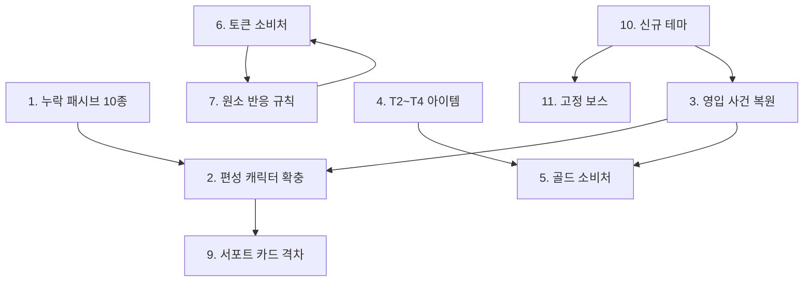

# 기획 필요 항목 (Design Backlog)

> **당신이 결정해야 하는 것들.** 각 항목은 코드나 데이터로 해결할 수 없고, **설계 판단이 선행되어야** 진행 가능하다.
> 항목마다 `결정 사항 / 판단 근거 / 선택지 / 결정 후 작업`을 적었다.
> 결정이 끝난 항목은 해당 상세 기획서로 옮기고 여기서 지운다.

최종 갱신: 2026-08-12

---

## 우선순위 요약

| # | 항목 | 등급 | 막고 있는 것 |
| --- | --- | --- | --- |
| 1 | **다단히트 × 피해당 발동 효과** | 🔴 P0 | 세이가 설계치의 3.7배 피해 |
| 2 | 영입 사건 복원 | 🔴 P0 | Locked 캐릭터 6인 획득 불가 |
| 3 | T2~T4 아이템 | 🟠 P1 | 보상 확률표 공회전 |
| 4 | 골드 소비처 | 🟠 P1 | 재화 루프 미완결 |
| 5 | 토큰 소비처 + 원소 매핑 | 🟠 P1 | 재화 루프 미완결 |
| 6 | 원소 상성/반응 규칙 | 🟠 P1 | 원소 시스템 절반 미완 |
| 7 | 회피율·발동률 존폐 | 🟠 P1 | DEX/INT 설계 의도 절반 사망 |
| 8 | 서포트 카드 격차 정책 | 🟠 P1 | 첫 런 난이도 예측 불가 |
| 9 | 신규 테마 (스프라이트 선행) | 🟡 P2 | 100스테이지 내내 한 테마 반복 |
| 10 | 고정 보스 재설계 | 🟡 P2 | 체크포인트 부재 |
| 11 | 중간 보스 난이도 | 🟠 P1 | 8스테이지 여유율 18% — 7스테이지(52%)보다 쉽다 |
| 12 | 메인 사망 시 정책 | 🟡 P2 | 의도치 않은 동작 |
| 13 | 츠쿠요미 '만월' 발동 조건 | 🟠 P1 | 일본 테마 복원 전까지 미발동 |
| 14 | 스탠딩 CG 목록 | 🟡 P2 | 연출 자산 |

---

# P0 — 게임이 성립하기 위해 필요한 것

## 1. 다단히트와 '피해당 발동' 효과의 곱연산

### 결정 사항

**유도탄·다단히트 스킬에서 "피해를 가할 때마다" 발동하는 효과를 발당 세는가, 공격당 세는가?**

### 판단 근거 — 세이가 설계치의 3.7배를 낸다

세이의 일반공격이 **유도탄 6발**로 바뀌면서, 발마다 `OnDamageDealt`가 따로 발행된다.
초기 패시브 `최초의 노래`는 이 이벤트에 걸려 있으므로 **한 번 공격에 6번 터진다.**

| 창조 단계 | 발당 고정피해 | ×6발 | 일반공격 본체 | 실제 증가율 | **설계 목표** |
| --- | --- | --- | --- | --- | --- |
| 1 | 33 | 198 | 352 | **56%** | 15% |
| 2 | 48 | 288 | 352 | **82%** | 22% |
| 3 | 66 | 396 | 352 | **112%** | 30% |

(세이 Lv.1 INT 22 기준)

같은 문제가 **궁극기 `창세`의 추가 고정 피해**에도 그대로 있고,
앞으로 다단히트 스킬이 늘어날수록 모든 "피해당 발동" 패시브에 번진다.
`_resolving` 플래그는 무한 재귀만 막을 뿐 발당 중복은 막지 못한다.

### 선택지

| 안 | 내용 | 영향 |
| --- | --- | --- |
| **A** | `OnDamageDealt`에 **공격 단위 식별자**를 실어 발당 1회만 발동 | 근본 해결. `DamageContext`에 swing id 추가 필요 |
| **B** | 발당 발동을 유지하되 **다단히트는 계수를 히트 수로 나눈다** | 코드별 대응이라 누락되기 쉽다 |
| **C** | 발당 발동을 **의도된 시너지로 인정**하고 계수를 재조정 | 세이가 "격이 다른 최강자"라는 설정과는 맞는다 |

> **권장: A.** 다단히트는 앞으로 계속 늘어날 텐데, B·C는 스킬을 추가할 때마다 같은 판단을 반복해야 한다.
> C를 택하더라도 **의도임을 문서에 명시**해야 다음 사람이 버그로 오해하지 않는다.

### 결정 후 작업

A 선택 시 — `DamageContext`에 공격 식별자 추가 → `Unit.TakeDamage`가 전파 →
`SeiCreation` / `SeiSanctuary`가 식별자별 1회만 처리

---

## 2. 영입 사건 복원

### 판단 근거

테마 정리로 사건이 **1개**만 남았고, 그 하나도 `continue`뿐인 복선형이다.

| 미사용 액션 | 원래 담당하던 사건 |
| --- | --- |
| `recruit` | 수르트, 츠쿠요미 영입 |
| `battle_recruit` | 케찰코아틀 시련 |
| `battle_item` | 격노한 케찰코아틀 → 마카나 |
| `pay_gold` | 케찰코아틀 공물 |
| `grant_passive` | 월신의 가호 |

**현재 게임에는 전력이 변하는 사건이 하나도 없다.**
동시에 골드의 유일한 소비처(`pay_gold`)도 함께 사라져 항목 5가 더 급해졌다.

### 선택지

| 안 | 내용 | 비고 |
| --- | --- | --- |
| **A** | 콜로세움 전용 영입 사건 신규 작성 | 세계관 정합. 보관 캐릭터 3인은 여전히 잠김 |
| **B** | 기존 3개 사건을 콜로세움 배경으로 각색 | 대사 배경(눈보라·신전·달밤)을 로마로 고쳐야 함 |
| **C** | 보관 캐릭터를 캐릭터 선택에서 바로 개방 | 사건 없이 해결. 서사 손실 |

> **권장: A + C.** C로 당장의 편성 부족을 풀고, A로 사건의 역할을 회복한다.

---

# P1 — 시스템을 완성하기 위해 필요한 것

## 3. T2~T4 아이템

### 결정 사항

**중간 등급 아이템을 무엇으로 채울 것인가?**

### 판단 근거

| 티어 | 아이템 수 | 보상 풀 등장 |
| --- | --- | --- |
| T1 | 14 | O |
| **T2~T4** | **0** | 🔴 |
| T5 | 1 | ✕ (사건 전용) |

보상 티어 확률표는 라운드 2부터 T2 이상을 뽑도록 설계되어 있으나, **뽑을 물건이 없다.**

### 채워야 할 매트릭스

현재 아이템은 `Armor` / `MainHand` / `OffHand` 세 슬롯에만 존재한다.
비어 있는 슬롯: **`Head`, `Necklace`, `Ring`, `Shoes`**

| 슬롯 \ 티어 | T2 | T3 | T4 |
| --- | --- | --- | --- |
| Head | | | |
| Necklace | | | |
| Armor | | | |
| Ring | | | |
| Shoes | | | |
| MainHand | | | |
| OffHand | | | |

**최소 권장: 티어당 3~4개 = 총 9~12개**

### 아이템당 정할 것

`slot`, `category`, `requiredProficiency`, `rarity`, `weight`, `statBonuses`, `codeGrants`(선택)

> **`codeGrants`가 아이템을 재미있게 만든다.** 단순 스탯 상승만으로는 T4와 T2의 체감 차이가 나지 않는다.
> 티어가 올라갈수록 코드 부여 비중을 높이는 것을 권한다.

### 관련 미해결

콜로세움 테마에는 `uniqueRewardIds`가 아예 없다. 테마 고유 보상 설계가 통째로 비어 있다.
(노르드의 `nordic_fury`는 실체 없이 선언만 되어 있었고, 테마와 함께 제거되었다.)

---

## 4. 골드 소비처

### 결정 사항

**전투로 번 골드를 어디에 쓰는가?**

### 판단 근거

| | 현재 |
| --- | --- |
| 획득 | 킬당 `25 × 스테이지` — 100스테이지에서 킬당 2,500골드 |
| 소비 | 🔴 **없음** |

개편 전에는 사건 선택지 `pay_gold`가 유일한 소비처였으나, **그 사건이 제거되면서 소비처가 0이 되었다.**
골드는 이제 벌기만 하고 쓸 수 없다.

### 선택지

| 안 | 내용 | 필러 정합성 |
| --- | --- | --- |
| **A** | 준비 페이즈 상점 — 아이템 구매 | O. 준비 단계 의사결정 강화 |
| **B** | 보상 리롤 비용 | O. 리롤 티켓과 통합 가능 (항목 6) |
| **C** | 준비 행동 추가 구매 (현재 1회 제한 해제) | O. 행동 제한이 이미 있으므로 자연스럽다 |
| **D** | 훈련 강화 비용 | △. 육성 루프에 재화 판단이 섞인다 |

> **권장: A + C.** 둘 다 준비 페이즈에 붙어 "전투 사이의 선택"이라는 필러 2를 강화한다.
> 오토체스식 상점 리롤은 [메인 기획서 §12](GDD_Main.md#12-하지-않기로-한-것)에서 배제했으므로,
> **고정 재고 상점**(리롤 없음) 형태를 권한다.

### 함께 정할 것

- 골드 획득량 곡선 유지 여부 (`25 × 스테이지`는 후반 인플레가 심하다)
- 가격 곡선 — 스테이지 비례인가 고정인가

---

## 5. 토큰 소비처 + 원소 매핑 정리

### 결정 사항 A — 토큰을 어디에 쓰는가?

현재 3킬마다 무작위 토큰 5개가 들어오지만 **`SpendToken()`을 호출하는 곳이 없다.**

| 안 | 내용 |
| --- | --- |
| **A** | 원소별 강화 — 해당 원소 유닛의 능력치/코드 강화 |
| **B** | 장비 제작/각인 — 특정 토큰 조합으로 아이템 생성 |
| **C** | 원소 부착 소모품 — 전투 전 아군에 원소 부여 |
| **D** | 제거 — 시스템을 걷어낸다 |

> 토큰이 원소와 1:1 대응하도록 만들어져 있으므로 **A 또는 C가 자연스럽다.**
> 특히 C는 항목 7(원소 반응)과 맞물려 전투 전 준비 선택을 만든다.

### 결정 사항 B — 원소/토큰 매핑 불일치

| 토큰 | 대응 원소 | 상태 |
| --- | --- | --- |
| 불 | Pyro | O |
| 물 | Hydro | O |
| 풀 | Dendro | O |
| 바람 | Anemo | O |
| 땅 | Geo | O |
| 얼음 | Cryo | O |
| **빛** | **없음** | 🔸 |
| 어둠 | Void | O |
| **없음** | **Electro** | 🔸 |

**"빛" 토큰에 대응하는 원소가 없고, Electro(츠쿠요미의 원소)에 대응하는 토큰이 없다.**
둘 중 하나를 고쳐야 한다 — 빛→Electro로 개명하거나, Light 원소를 추가하거나.

---

## 6. 원소 상성/반응 규칙

### 결정 사항

**원소는 부착 외에 무엇을 하는가?**

### 판단 근거

현재 구현된 것: 고유 원소 보유, 임시 부착(9.5초), 부착 여부 조회
현재 용도: **코드/패시브의 조건 판정 트리거뿐**

원소가 9종(무속성 포함)이나 있고 토큰까지 대응시켜 뒀는데, 상성표도 반응도 저항도 없다.

### 선택지

| 안 | 내용 | 복잡도 |
| --- | --- | --- |
| **A** | 상성 배율만 (가위바위보식 피해 증감) | 낮음 |
| **B** | 원신식 반응 (증폭/확산/결정 등) | 높음 |
| **C** | 현행 유지 — 조건 트리거 전용으로 확정 | 없음 |

> **C도 정당한 선택이다.** 다만 그렇다면 원소를 9종이나 둘 이유가 없으므로 **정리하거나 명시적으로 확정**해야 한다.
> 현재는 "만들다 만" 상태로 보인다.

---

## 7. 회피율·코드 발동률 존폐

### 결정 사항

**DEX의 회피, INT의 발동률을 살릴 것인가 걷어낼 것인가?**

### 판단 근거

| 파생 | 현재값 | 상태 |
| --- | --- | --- |
| `GetDerivedEvasionChance()` | **0 고정** | 회피 판정 코드는 존재하나 파생값이 0 |
| `GetDerivedCodeActivationChance()` | **1.0 고정** | INT 기반 발동률이 무효화됨 |

문서상 DEX는 "속도 + 회피", INT는 "발동률 + 마나 효율"을 담당하지만 **각각 절반이 죽어 있다.**
현재 INT의 실질 기능은 마나 효율과 코드 보유 한도(`max(3, INT)`)뿐이다.

### 선택지

| 안 | 내용 |
| --- | --- |
| **A** | 파생 공식 부활 (예: 회피 `DEX × 0.3%`, 발동률 `50% + INT × 2%`) |
| **B** | 정식 제거 — 문서에서 지우고 DEX/INT에 다른 역할 부여 |
| **C** | 항목 1의 선택지 C와 통합 — DEX/INT를 화력 파생에 편입 |

> 항목 1에서 **선택지 C(5스탯 파생 화력)** 를 택하면 이 문제가 자연히 해소된다. 함께 결정하는 것을 권한다.

---

## 8. 서포트 카드 격차 정책

### 결정 사항

**첫 런(카드 없음)과 숙련 런(고급 카드)의 성장 격차를 얼마로 허용하는가?**

### 판단 근거

훈련 1회당 집중 스탯 강화량:

```
카드 없는 서포트 4명 (전원 특기 일치):
  1 + 4 × (1 + 1) = 9

고급 카드 서포트 4명 (전원 등장 + 특기 일치 + 우정 훈련):
  1 + 4 × (6 + 8 + 8) = 89
```

**약 10배 격차.** 100스테이지 누적이면 +900 vs +8,900이다.

현재는 첫 런에서 카드를 얻을 수 있는 캐릭터가 아탈란테뿐이라 **이 격차가 아직 관측되지 않는다.**
항목 4(메인 확충)를 해결하는 순간 곧바로 드러난다.

### 선택지

| 안 | 내용 |
| --- | --- |
| **A** | 격차 유지 — 계승 보상을 크게 (로그라이트 메타 진행 강조) |
| **B** | 카드 보너스 상한 하향 (`trainingBonus` 0~6 → 0~3 등) |
| **C** | 카드 없는 서포트의 기본 보너스 상향 (`SupportStatBonusPerUnit` 1 → 3) |
| **D** | 난이도를 육성 완료 캐릭터 수에 연동 |

> **선행 검증 필요.** 항목 1·2(성장 곡선·스케일)가 정해지기 전에는 이 격차가 실제로 어느 정도 체감되는지 계산할 수 없다.

---

# P2 — 콘텐츠와 완성도

## 9. 신규 테마 (스프라이트 선행)

현재 테마는 **콜로세움 하나뿐**이라 100스테이지 내내 같은 적 9종이 반복된다.

전용 적 초상화가 없어 노르드(적 12종)·아즈텍(적 9종)·일본 테마를 제거했다.
**일본·노르드 테마는 다시 추가하기로 확정**되었다. 일본 테마에는 보관 중인 츠쿠요미의
영입 사건을 붙인다. 수르트는 Starter로 개방되어 노르드 영입 사건이 필수 획득 경로는 아니다.

**테마를 늘리려면 아트 자산이 먼저다.** 순서는 다음과 같다.

1. 전용 적 초상화 확보
2. `60_enemies.yaml`에 해당 `themeId`의 normal 6~9종 + elite 1~2 + boss 1 등록
3. `80_stages.yaml` `stageThemes`에 항목 추가 (`enemyThemeId`를 적 `themeId`와 일치)
4. 테마 사건 추가 — **영입 사건을 함께 넣어 보관 캐릭터를 되살릴 것**

> 제거된 적 데이터는 git 히스토리에 남아 있으므로, 스프라이트만 준비되면 스탯을 새 규격으로
> 옮겨 되살릴 수 있다(5스탯만 재산정하면 된다).

## 10. 고정 보스 재설계

`fixedBossStages`가 **비어 있다.** 25/50/75/100 지점의 체크포인트가 사라졌다.

테마가 하나뿐인 지금은 10스테이지마다 스파르타쿠스가 반복 등장하므로 고정 보스를 넣을 자리가 없다.
**항목 10(신규 테마)이 선행되어야 의미가 생긴다.**

정할 것: 네 지점의 보스를 각각 무엇으로 할 것인가. 100스테이지는 육성 모드의 최종 보스이므로 전용 제작을 권한다.

## 11. 중간 보스 난이도

8스테이지 중간 보스(사비나)가 **단독 출현이라 약 11초 만에 끝난다.**
같은 라운드의 7스테이지(일반 5기)가 27.7초 걸리는 것과 비교하면 오히려 쉬운 구간이다.

선택지: 호위 2~3기를 함께 배치 / 엘리트 내구 추가 상향 / 중간 보스 슬롯 자체를 재고

> 보스(10스테이지)는 20.4초로 적절하다. 문제는 중간 보스 슬롯뿐이다.


모든 영웅의 `startingProficiencies`에 최소 무기 1종을 데이터화했다. 방어구 숙련은 캐릭터별로 두며, 숙련이 없는 캐릭터는 의복을 사용한다. 설정상 필요한 복수 무기·방패는 시작 숙련에 함께 둘 수 있다.
보주·단궁·쇠뇌 숙련을 추가했고, 시의 만류귀종과 아탈란테의 궁수/민첩함이 추가 숙련을 연다.
이미 가진 숙련을 다시 얻으면 별도 중첩 효과 없이 자연스럽게 무시된다.

## 12. 메인 사망 시 정책

`TrainingManager.GetMainUnit()`은 메인을 못 찾으면 **첫 활성 아군**을 반환한다.
메인이 전사한 스테이지에서 **의도치 않은 캐릭터가 메인으로 승격되어 육성된다.**

선택지: 육성 페이즈 스킵 / 메인 자동 부활 / 명시적 메인 교체 UI / 런 실패

## 13. 츠쿠요미 '만월' 발동 조건

| 항목 | 내용 |
| --- | --- |
| 사양 | **'일본' 테마 또는 '밤' 필드**에서 주는 피해 +50%, 받는 피해 −50% |
| 구현 | `ThemeDamageEffect` → `CurrentThemeHasTag("Japan") \|\| ("Night")` |
| 문제 | 일본 테마가 제거되어 현재 영구 미발동. 콜로세움 태그는 `[Colosseum, Rome, Festival]` |

**일본 테마를 다시 추가하기로 했으므로 자연히 해소된다.** 그때 `tags`에 `Japan`을 넣으면 된다.
그 전까지 츠쿠요미를 쓸 일이 없으므로(보관 상태) 급하지 않다.

> 🔸 '밤' 필드는 아직 개념만 있고 어떤 테마에도 `Night` 태그가 없다.
> 시간대/필드 속성을 도입할지는 별도 판단이 필요하다.

## 14. 스탠딩 CG 목록

아군 전원에게 `standing`이 연결되어 있다. 피그말리온은 2026-08-12 원본을 적용하고 동일 원화 기반 Portrait를 파생했다. 적 9종도 전원 Standing/Portrait를 가진다.

---

## 부록 — 결정 순서 의존 관계



캐릭터 성장 보상 공백은 해소되었다. 다음 우선순위는 Locked 캐릭터의 영입 사건과 영구 해금 저장이다.
