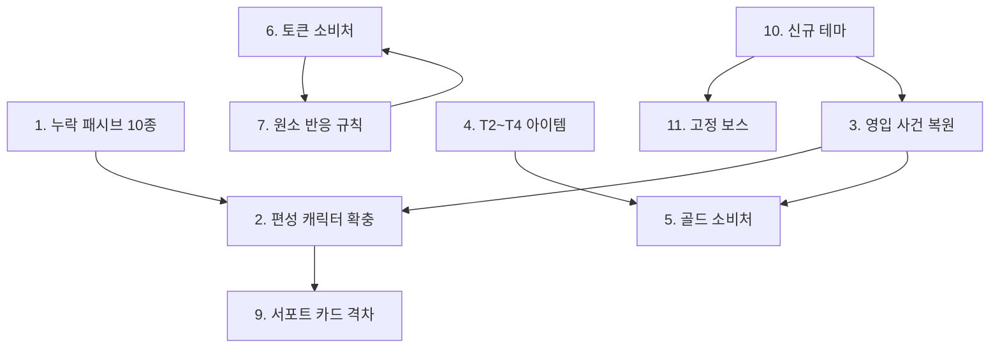

# 기획 필요 항목 (Design Backlog)

> **당신이 결정해야 하는 것들.** 각 항목은 코드나 데이터로 해결할 수 없고, **설계 판단이 선행되어야** 진행 가능하다.
> 항목마다 `결정 사항 / 판단 근거 / 선택지 / 결정 후 작업`을 적었다.
> 결정이 끝난 항목은 해당 상세 기획서로 옮기고 여기서 지운다.

최종 갱신: 2026-08-24

---

## 우선순위 요약

| # | 항목 | 등급 | 막고 있는 것 |
| --- | --- | --- | --- |
| 1 | 츠쿠요미 순환 — 상한 없는 곱연산 | 🟠 P1 | 4중첩 시 ×2.44 / ×0.32 |
| 2 | 곱연산 방어의 누적 | 🟠 P1 | 최대 86% 피해 감소 |
| 3 | 다단히트 × 피해당 발동 | 🟠 P1 | 스킬마다 판단이 갈림 |
| 4 | 내구 티어 스케일링 | 🟠 P1 | 고정값이라 후반에 무의미해짐 |
| 5 | 영입 사건 복원 | 🔴 P0 | Locked 캐릭터 6인 획득 불가 |
| 6 | T3~T4 아이템 · 테마 무관 T2 | 🟠 P1 | 보상 확률표 공회전 |
| 7 | 골드 소비처 | 🟠 P1 | 재화 루프 미완결 |
| 8 | 토큰 소비처 + 원소 매핑 정리 | 🟠 P1 | 재화 루프 미완결 |
| 9 | 원소 상성/반응 규칙 | 🟠 P1 | 원소 시스템 절반 미완 |
| 10 | 회피율·코드 발동률 존폐 | 🟠 P1 | DEX/INT 설계 의도 절반 사망 |
| 11 | 서포트 카드 격차 정책 | 🟠 P1 | 첫 런 난이도 예측 불가 |
| 12 | 신규 테마 (스프라이트 선행) | 🟡 P2 | 로마 군단 12종이 임시 스프라이트로 돌아간다 |
| 13 | 고정 보스 재설계 | 🟡 P2 | 체크포인트 부재 |
| 14 | 중간 보스 난이도 | 🟠 P1 | 8스테이지 여유율 18% |
| 15 | 메인 사망 시 정책 | 🟡 P2 | 의도치 않은 동작 |
| 16 | 츠쿠요미 '만월' 발동 조건 | 🟠 P1 | 일본 테마 복원 전까지 미발동 |
| 17 | 스탠딩 CG 목록 | 🟡 P2 | 연출 자산 |
| 18 | 소환수를 실제 개체로 승격할지 | 🟡 P2 | 펜리르·마카라가 체력을 못 가짐 |
| 19 | 남은 원소 반응 | 🟠 P1 | 바람·어둠 조합 미정 (바위는 공명으로 채움) |
| 20 | 강인도 부여 대상 확대 여부 | 🟡 P2 | 현재 오르페우스 전용 |
| 21 | 옥타비아·카이사르 획득 경로 | 🟠 P1 | 아군 데이터는 있으나 Locked이고 영입 사건이 없다 |

---

# 2026-08-24 반영 완료 — 로마 군단 테마

두 번째 테마 **로마 군단**(테마 id 5 / 적 themeId 6)을 추가했다. 적 12종, 코드 41종,
공용 해금 패시브 5종, 레기온 T2 장비 9종, 원소 반응 '공명'이 함께 들어갔다.

| 항목 | 위치 |
| --- | --- |
| 적 로스터·편성 | [Detail_09](Detail_09_Enemy_Catalog.md) |
| 중간 보스(아그리파+옥타비아)·보스(카이사르) | [Detail_10](Detail_10_Boss_Catalog.md) |
| ID별 코드 효과 색인 | [Detail_11](Detail_11_Code_Catalog.md) |
| 레기온 T2 장비 | [Detail_13 §2.2](Detail_13_Reward_Catalog.md) · [Detail_14 §4](Detail_14_Equipment_Catalog.md) |
| 공명(바위+바위)·기절 | [Detail_02 §6.3](Detail_02_Combat.md) · `ElementalReactions.cs` · `ControlStatuses.ApplyStun` |

함께 들어간 엔진 변경:

| 변경 | 이유 |
| --- | --- |
| `Code.PowerStatCoefficient` — 위력의 스탯 비례 성분 | `고정값 + 스탯 × 계수` 형식 도입 |
| `RoundManager.ContentSlotInRound` — 고정 보스 라운드 슬롯 시프트 | 기획의 '2번 슬롯 스킵' 규칙 |
| `stagePatterns`가 중간 보스·보스 단독 스폰보다 우선 | 보스에게 호위를 붙이기 위해 (항목 14의 처방) |
| `midBossStageInRound` (기본 8) | 로마 군단은 중간 보스가 9스테이지 |
| `ItemData.themeIds` + 보상 풀 필터 | 테마 전용 보상 (항목 6의 '테마 고유 보상' 공백) |
| `DamageTag.DurabilityPenetration` · `Pierce` | 심안(내구 무시)과 찌르기 분류 |
| `BaseEffect.EvasionChanceAdditiveModifier` | 조건부 회피 (에퀴테스 '기병의 회피') |
| `BaseEffect.RoundStartActionAdjustment` · `ActionScheduler.DelayAction` | 전투 시작 시 행동 게이지 조작 (야습) |

**밸런스 조정** — `예리함`(73)의 초과 치명타 확률 전환 배율을 ×2 → **×1.5**로 낮췄다.

### 위력의 두 번째 형식

로마 테마 전체가 **`위력 = 고정값 + 시전자 스탯 × 계수`** 형식을 쓴다(`Code.PowerStatCoefficient`).
고정값이 저점을 보장하고, 계수를 작게 잡아 고점을 억제한다.
정의는 [Detail_02 §3.2-A](Detail_02_Combat.md)를 본다.

> **계수를 크게 잡으면 위험하다.** 위력 자체가 스탯에 비례하면 최종 피해가 `스탯²`에 가깝게 자란다.
> 로마 테마의 계수는 0.2~1.6에 묶어 두었다.

### 플레이어 버전 3인

아그리파(40) · 옥타비아(41) · 카이사르(42)를 `10_units.yaml`에 등록했다.
**보스로 등장할 때만 붙는 패시브(312~317, 옥타비아의 284 심안)를 뺀 것**이 플레이어 버전이다.
사양은 [Detail_08 §24~26](Detail_08_Confirmed_Characters.md), 대조표는
[Detail_10 §4](Detail_10_Boss_Catalog.md)를 본다.

### 고정 보스 라운드의 슬롯 시프트

기획대로 **2번 슬롯을 건너뛰고 이후를 1씩 당기는** 규칙을 구현했다.
결과적으로 테마 보스는 9번째 전투로 당겨지고 마지막 칸이 고정 보스 자리가 된다.
편성·사건·보스 판정은 이제 `RoundManager.ContentSlotInRound`를 기준으로 한다.
**세울 보스만 정하면 된다** — 항목 13.

### 이 작업이 남긴 판단거리

| # | 항목 | 내용 |
| --- | --- | --- |
| 13 | **고정 보스 4종** | 슬롯 규칙은 끝났고 `fixedBossStages`에 넣을 보스만 남았다 |
| 21 | **옥타비아·카이사르 획득 경로** | 둘 다 Locked인데 영입 사건이 없어 지금은 편성할 수 없다 |
| 12 | **로마 군단 스프라이트** | 12종 전부 콜로세움 적 초상화를 임시로 돌려 쓴다. 원본이 9종뿐이라 옵티오·트리뷴·아그리파는 다른 병종과 그림이 겹친다 |
| 2 | **직감(282) 훈련 훅** | 인드라의 `천재`(251)와 같은 선언형 상태다. 훈련 계산이 아직 읽지 않는다 |

---

# 2026-08-21 반영 완료 — 신규 캐릭터 7인과 파생 규칙

프레이아 · 로키 · 스카디 · 쿠베라 · 바루나 · 오르페우스 · 스사노오를 추가하고
세이를 리워크했다. 상세는 [Detail_08](Detail_08_Confirmed_Characters.md) §17~25,
새 전투 규칙은 [Detail_02](Detail_02_Combat.md) §4-A를 본다.

| 규칙 | 위치 |
| --- | --- |
| 빙결 (얼음+물, 행동 불가만) | `ControlStatuses.ApplyFreeze` · `ElementalReaction` |
| 에어본 (CON 비교, 행동 불가만) | `ControlStatuses.ApplyAirborne` |
| 강인도 (가상 체력, 처치 판정만 발행) | `Unit.GrantToughness` / `Unit.ReduceToughness` |
| 소환수 (칸 없음, 소환자 버프 미상속) | `Combat.Summons` |
| 순수치유량 | `Unit.RoundEffectiveHealingDone` |
| 원소 판정 (부착과 분리) | `Unit.AddElementJudgement` |
| 팔랑크스 재설계 + Greek 하드코딩 | `GreekPhalanx` · `Unit.LoadPassiveCodes` |
| 유닛 중복 출전 금지 | `CharacterSelectScreen.Candidates` |

### 남은 판단거리

| # | 항목 | 내용 |
| --- | --- | --- |
| 18 | **소환수 승격** | 지금은 소환자에 붙는 논리 객체다. 체력을 갖거나 적에게 맞는 소환수가 필요해지면 실제 `Unit`으로 올려야 한다. 그때 '칸을 차지하지 않는다'를 어떻게 유지할지 정해야 한다 |
| 19 | **남은 원소 반응** | 감전·화상·빙결·공명 넷이 있다. **바람·어둠**이 낀 조합은 아직 아무 일도 일어나지 않는다 |
| 20 | **강인도 확대** | 현재 오르페우스만 부여한다. 적 엘리트가 자기 강인도를 갖는 설계로 넓힐지, 오르페우스 전용 장치로 둘지 |

> 🔸 **월식 정산과 강인도의 상호작용** — 지속피해를 가진 적의 강인도를 깨면 츠쿠요미 `월식 정산`이
> 발동한다. 그 적이 실제로 죽을 때 또 발동하므로 한 대상에게서 두 번 터진다.
> 강인도의 '처치 판정 이익'을 문자 그대로 구현한 결과이며 의도된 동작으로 둔다.

---

# P0 — 게임이 성립하기 위해 필요한 것
## 1. 츠쿠요미 순환 — 상한 없는 곱연산

`순환(Lv.44)`은 아군이 죽을 때마다 생존 아군 하나에게
**주는 피해 ×1.25 / 받는 피해 ×0.75**를 부여한다. 중첩 정책이 `Stack`이고 키에 카운터가 붙어
**같은 유닛에 무제한으로 쌓인다.**

| 아군 사망 수 | 주는 피해 | 받는 피해 |
| --- | --- | --- |
| 1 | ×1.25 | ×0.75 |
| 2 | ×1.56 | ×0.56 |
| 3 | ×1.95 | ×0.42 |
| 4 | **×2.44** | **×0.32** |

파티가 5인이므로 자연 상한은 4중첩이지만, **전멸 직전에 남은 하나가 2.4배 화력과 3배 내구를 얻는다.**
역전 장치로는 매력적이나 상한이 명시되어 있지 않다.

**정할 것** — 중첩 상한(예: 2)을 둘 것인가, 아니면 역전 장치로 유지할 것인가.

---

## 2. 곱연산 방어의 누적

받는 피해 배율은 전부 곱해진다. 한 유닛이 동시에 받을 수 있는 것만 모아도:

| 출처 | 배율 |
| --- | --- |
| 갑옷 숙련 | ×0.97 |
| 피그말리온 궁극기 장미의 가시 | ×0.50 |
| 츠쿠요미 순환 4중첩 | ×0.32 |
| **누적** | **×0.14 (86% 감소)** |

여기에 CON 기반 체력과 STR 기반 방어(최대 24~33%)가 별도로 곱해진다.
**§1이 해결되지 않으면 이 조합이 전부 동시에 성립한다.**

**정할 것** — 받는 피해 감소에 **하한(예: ×0.35)** 을 둘 것인가, 아니면 개별 수치를 낮출 것인가.

---

## 3. 다단히트 × 피해당 발동

세이 리메이크로 일반공격은 단일 타격이 되었고, 피해당 발동은 8초 궁극기 `성역`으로 이동했다.
같은 구조가 다른 곳에도 있다.

| 대상 | 구조 |
| --- | --- |
| 아마테라스 `태양의 박자` | `OnNormalAttackHit`마다 DEX +4 스택 (상한 6). 다단히트면 한 방에 만중첩 |
| 처형 패시브 (`천살성` / `당연한 운명`) | `OnDamageDealt`마다 판정 — 다단히트에서 발당 검사 |
| 시 `시의 종언` | 적중마다 스택 — 다단히트 무기를 들면 스택이 폭증 |

**정할 것** — 앞으로 다단히트 스킬을 추가할 때 **발당 발동을 기본으로 할지, 공격당 1회를 기본으로 할지.**
기본값을 정해 두지 않으면 스킬마다 판단이 갈린다.

---

## 4. 내구 티어 스케일링

### 판단 근거

내구는 **고정값**으로 피해를 깎는다. 그런데 이 게임은 피해가 레벨에 선형 비례해 자란다.

| 구간 | 대략적 피해 | 내구 10의 경감률 |
| --- | --- | --- |
| Lv.1 | 200~300 | 3~5% |
| Lv.50 | 1,500 | 0.7% |
| Lv.100 | 3,000 | 0.3% |

**T1 값 그대로 두면 후반에는 없는 것과 같다.** 방어력은 기준값을 레벨에 연동해 이 문제를 피했지만,
내구는 "고정 경감"이 정체성이라 같은 수법을 쓸 수 없다.

### 선택지

| 안 | 내용 |
| --- | --- |
| **A** | 상위 티어 방어구의 내구를 크게 올린다 (`T1 × (1 + (rarity−1) × 0.6)`을 더 가파르게) |
| **B** | 내구에 레벨 성장분을 더한다 (`장비 내구 + 레벨 × k`) — 고정 경감 성격은 유지 |
| **C** | 초반 전용 장치로 인정하고 후반에는 무의미해지도록 둔다 |

> 현재는 A를 전제로 T1 값만 정해 둔 상태다(의복 2 / 경갑 5 / 방패 6 / 중갑 10 / 판금 16).
> **T2~T4 아이템을 만들 때 내구 곡선을 함께 정해야 한다.**

### 참고 — 내구의 고유한 성질

내구는 **다단히트를 저타수보다 훨씬 강하게 억제한다.** 발마다 고정값이 빠지기 때문이다.

| 공격 형태 | 내구 10 적용 시 경감률 |
| --- | --- |
| 1발 300 | 3% |
| 6발 × 59 | **17%** |

세이식 유도탄 빌드에 대한 자연스러운 대항 수단이므로, 이 성질을 유지할지도 함께 정한다.

---

## 5. 영입 사건 복원

### 판단 근거

테마 정리로 사건이 **1개**만 남았고, 그 하나도 `continue`뿐인 복선형이다.

| 미사용 액션 | 원래 담당하던 사건 |
| --- | --- |
| `recruit` | 수르트, 츠쿠요미 영입 |
| `battle_recruit` | 케찰코아틀 시련 |
| `battle_item` | 격노한 케찰코아틀 → 마카나 |
| `pay_gold` | 케찰코아틀 공물 |
| `grant_passive` | 월신의 가호 |

**현재 게임에는 전력이 변하는 사건이 하나도 없다.**
동시에 골드의 유일한 소비처(`pay_gold`)도 함께 사라져 항목 5가 더 급해졌다.

### 선택지

| 안 | 내용 | 비고 |
| --- | --- | --- |
| **A** | 콜로세움 전용 영입 사건 신규 작성 | 세계관 정합. 보관 캐릭터 3인은 여전히 잠김 |
| **B** | 기존 3개 사건을 콜로세움 배경으로 각색 | 대사 배경(눈보라·신전·달밤)을 로마로 고쳐야 함 |
| **C** | 보관 캐릭터를 캐릭터 선택에서 바로 개방 | 사건 없이 해결. 서사 손실 |

> **권장: A + C.** C로 당장의 편성 부족을 풀고, A로 사건의 역할을 회복한다.

---

# P1 — 시스템을 완성하기 위해 필요한 것

## 6. T2~T4 아이템

### 결정 사항

**중간 등급 아이템을 무엇으로 채울 것인가?**

### 판단 근거

| 티어 | 아이템 수 | 보상 풀 등장 |
| --- | --- | --- |
| T1 | 14 | O (전 테마) |
| **T2** | **9** | △ (**로마 군단 테마 전용** — 레기온 세트) |
| **T3~T4** | **0** | 🔴 |
| T5 | 1 | ✕ (사건 전용) |

보상 티어 확률표는 라운드 2부터 T2 이상을 뽑도록 설계되어 있다.
T2는 레기온 세트로 채웠지만 **테마 전용이라 콜로세움 라운드에서는 여전히 T1으로 폴백한다.**
T3~T4는 그대로 비어 있다.

### 채워야 할 매트릭스

현재 아이템은 `Armor` / `MainHand` / `OffHand` 세 슬롯에만 존재한다.
비어 있는 슬롯: **`Head`, `Necklace`, `Ring`, `Shoes`**

| 슬롯 \ 티어 | T2 | T3 | T4 |
| --- | --- | --- | --- |
| Head | | | |
| Necklace | | | |
| Armor | | | |
| Ring | | | |
| Shoes | | | |
| MainHand | | | |
| OffHand | | | |

**최소 권장: 티어당 3~4개 = 총 9~12개**

### 아이템당 정할 것

`slot`, `category`, `requiredProficiency`, `rarity`, `weight`, `statBonuses`, `codeGrants`(선택)

> **`codeGrants`가 아이템을 재미있게 만든다.** 단순 스탯 상승만으로는 T4와 T2의 체감 차이가 나지 않는다.
> 티어가 올라갈수록 코드 부여 비중을 높이는 것을 권한다.

### 관련 미해결

테마 전용 보상 구조는 `ItemData.themeIds`로 만들어졌고 로마 군단이 첫 사례다.
**콜로세움 전용 보상은 아직 없다.** 테마마다 전리품 세트를 주는 방향으로 갈지,
테마 무관 T2를 따로 채울지 정해야 한다.

---

## 7. 골드 소비처

### 결정 사항

**전투로 번 골드를 어디에 쓰는가?**

### 판단 근거

| | 현재 |
| --- | --- |
| 획득 | 킬당 `25 × 스테이지` — 100스테이지에서 킬당 2,500골드 |
| 소비 | 🔴 **없음** |

개편 전에는 사건 선택지 `pay_gold`가 유일한 소비처였으나, **그 사건이 제거되면서 소비처가 0이 되었다.**
골드는 이제 벌기만 하고 쓸 수 없다.

### 선택지

| 안 | 내용 | 필러 정합성 |
| --- | --- | --- |
| **A** | 준비 페이즈 상점 — 아이템 구매 | O. 준비 단계 의사결정 강화 |
| **B** | 보상 리롤 비용 | O. 리롤 티켓과 통합 가능 (항목 6) |
| **C** | 준비 행동 추가 구매 (현재 1회 제한 해제) | O. 행동 제한이 이미 있으므로 자연스럽다 |
| **D** | 훈련 강화 비용 | △. 육성 루프에 재화 판단이 섞인다 |

> **권장: A + C.** 둘 다 준비 페이즈에 붙어 "전투 사이의 선택"이라는 필러 2를 강화한다.
> 오토체스식 상점 리롤은 [메인 기획서 §12](GDD_Main.md#12-하지-않기로-한-것)에서 배제했으므로,
> **고정 재고 상점**(리롤 없음) 형태를 권한다.

### 함께 정할 것

- 골드 획득량 곡선 유지 여부 (`25 × 스테이지`는 후반 인플레가 심하다)
- 가격 곡선 — 스테이지 비례인가 고정인가

---

## 8. 토큰 소비처 + 원소 매핑 정리

### 결정 사항 A — 토큰을 어디에 쓰는가?

현재 3킬마다 무작위 토큰 5개가 들어오지만 **`SpendToken()`을 호출하는 곳이 없다.**

| 안 | 내용 |
| --- | --- |
| **A** | 원소별 강화 — 해당 원소 유닛의 능력치/코드 강화 |
| **B** | 장비 제작/각인 — 특정 토큰 조합으로 아이템 생성 |
| **C** | 원소 부착 소모품 — 전투 전 아군에 원소 부여 |
| **D** | 제거 — 시스템을 걷어낸다 |

> 토큰이 원소와 1:1 대응하도록 만들어져 있으므로 **A 또는 C가 자연스럽다.**
> 특히 C는 항목 7(원소 반응)과 맞물려 전투 전 준비 선택을 만든다.

### 결정 사항 B — 원소/토큰 매핑 불일치

| 토큰 | 대응 원소 | 상태 |
| --- | --- | --- |
| 불 | Pyro | O |
| 물 | Hydro | O |
| 풀 | Dendro | O |
| 바람 | Anemo | O |
| 땅 | Geo | O |
| 얼음 | Cryo | O |
| **빛** | **없음** | 🔸 |
| 어둠 | Void | O |
| **없음** | **Electro** | 🔸 |

**"빛" 토큰에 대응하는 원소가 없고, Electro(츠쿠요미의 원소)에 대응하는 토큰이 없다.**
둘 중 하나를 고쳐야 한다 — 빛→Electro로 개명하거나, Light 원소를 추가하거나.

---

## 9. 원소 상성/반응 규칙

### 결정 사항

**원소는 부착 외에 무엇을 하는가?**

### 판단 근거

현재 구현된 것: 고유 원소 보유, 임시 부착(9.5초), 부착 여부 조회
현재 용도: **코드/패시브의 조건 판정 트리거뿐**

원소가 9종(무속성 포함)이나 있고 토큰까지 대응시켜 뒀는데, 상성표도 반응도 저항도 없다.

### 선택지

| 안 | 내용 | 복잡도 |
| --- | --- | --- |
| **A** | 상성 배율만 (가위바위보식 피해 증감) | 낮음 |
| **B** | 원신식 반응 (증폭/확산/결정 등) | 높음 |
| **C** | 현행 유지 — 조건 트리거 전용으로 확정 | 없음 |

> **C도 정당한 선택이다.** 다만 그렇다면 원소를 9종이나 둘 이유가 없으므로 **정리하거나 명시적으로 확정**해야 한다.
> 현재는 "만들다 만" 상태로 보인다.

---

## 10. 회피율·코드 발동률 존폐

### 결정 사항

**DEX의 회피, INT의 발동률을 살릴 것인가 걷어낼 것인가?**

### 판단 근거

| 파생 | 현재값 | 상태 |
| --- | --- | --- |
| `GetDerivedEvasionChance()` | **0 고정** | 회피 판정 코드는 존재하나 파생값이 0 |
| `GetDerivedCodeActivationChance()` | **1.0 고정** | INT 기반 발동률이 무효화됨 |

문서상 DEX는 "속도 + 회피", INT는 "발동률 + 마나 효율"을 담당하지만 **각각 절반이 죽어 있다.**
현재 INT의 실질 기능은 마나 효율과 코드 보유 한도(`max(3, INT)`)뿐이다.

### 선택지

| 안 | 내용 |
| --- | --- |
| **A** | 파생 공식 부활 (예: 회피 `DEX × 0.3%`, 발동률 `50% + INT × 2%`) |
| **B** | 정식 제거 — 문서에서 지우고 DEX/INT에 다른 역할 부여 |
| **C** | 항목 1의 선택지 C와 통합 — DEX/INT를 화력 파생에 편입 |

> 항목 1에서 **선택지 C(5스탯 파생 화력)** 를 택하면 이 문제가 자연히 해소된다. 함께 결정하는 것을 권한다.

---

## 11. 서포트 카드 격차 정책

### 결정 사항

**첫 런(카드 없음)과 숙련 런(고급 카드)의 성장 격차를 얼마로 허용하는가?**

### 판단 근거

훈련 1회당 집중 스탯 강화량:

```
카드 없는 서포트 4명 (전원 특기 일치):
  1 + 4 × (1 + 1) = 9

고급 카드 서포트 4명 (전원 등장 + 특기 일치 + 우정 훈련):
  1 + 4 × (6 + 8 + 8) = 89
```

**약 10배 격차.** 100스테이지 누적이면 +900 vs +8,900이다.

현재는 첫 런에서 카드를 얻을 수 있는 캐릭터가 아탈란테뿐이라 **이 격차가 아직 관측되지 않는다.**
항목 4(메인 확충)를 해결하는 순간 곧바로 드러난다.

### 선택지

| 안 | 내용 |
| --- | --- |
| **A** | 격차 유지 — 계승 보상을 크게 (로그라이트 메타 진행 강조) |
| **B** | 카드 보너스 상한 하향 (`trainingBonus` 0~6 → 0~3 등) |
| **C** | 카드 없는 서포트의 기본 보너스 상향 (`SupportStatBonusPerUnit` 1 → 3) |
| **D** | 난이도를 육성 완료 캐릭터 수에 연동 |

> **선행 검증 필요.** 항목 1·2(성장 곡선·스케일)가 정해지기 전에는 이 격차가 실제로 어느 정도 체감되는지 계산할 수 없다.

---

# P2 — 콘텐츠와 완성도

## 12. 신규 테마 (스프라이트 선행)

테마가 둘이 되어 라운드마다 번갈아 나온다. 다만 **로마 군단 12종은 전용 초상화가 없어
기존 스프라이트를 임시로 돌려 쓰고 있다.** 일부는 아군 초상화(오리온·테세우스·아스클레피오스)를
재사용했으므로 전용 자산 확보가 이 테마의 남은 최우선 작업이다.

전용 적 초상화가 없어 노르드(적 12종)·구 아즈텍(적 9종)·일본 테마를 제거했다.
아즈텍은 메히코 테마 7종과 케찰코아틀 조우로 전면 교체했으며 전용 스탠딩·초상화를 등록했다.
**일본·노르드 테마는 다시 추가하기로 확정**되었다. 일본 테마에는 보관 중인 츠쿠요미의
영입 사건을 붙인다. 수르트는 Starter로 개방되어 노르드 영입 사건이 필수 획득 경로는 아니다.

**테마를 늘리려면 아트 자산이 먼저다.** 순서는 다음과 같다.

1. 전용 적 초상화 확보
2. `60_enemies.yaml`에 해당 `themeId`의 normal 6~9종 + elite 1~2 + boss 1 등록
3. `80_stages.yaml` `stageThemes`에 항목 추가 (`enemyThemeId`를 적 `themeId`와 일치)
4. 테마 사건 추가 — **영입 사건을 함께 넣어 보관 캐릭터를 되살릴 것**

> 제거된 적 데이터는 git 히스토리에 남아 있으므로, 스프라이트만 준비되면 스탯을 새 규격으로
> 옮겨 되살릴 수 있다(5스탯만 재산정하면 된다).

## 13. 고정 보스 재설계

`fixedBossStages`가 **비어 있다.** 25/50/75/100 지점의 체크포인트가 사라졌다.

정할 것 두 가지다.

**네 지점의 보스를 각각 무엇으로 할 것인가.** 100스테이지는 육성 모드의 최종 보스이므로
전용 제작을 권한다.

슬롯 규칙은 이미 구현되어 있다 — 고정 보스가 낀 라운드는 2번 슬롯을 건너뛰고 이후를 1씩 당겨
마지막 칸을 비운다. 따라서 `fixedBossStages`에는 **각 라운드의 10번째 스테이지**를 적으면 된다
(3라운드 → 30, 5라운드 → 50, …).

> 🔸 원안의 지점 표기(25/50/75/100)는 라운드 내 위치와 맞지 않는다.
> 25·75는 라운드 내 5번, 50·100은 10번이다. 라운드 경계에 맞출지 스테이지 번호를 그대로 쓸지 정해야 한다.

## 14. 중간 보스 난이도

8스테이지 중간 보스(사비나)가 **단독 출현이라 약 11초 만에 끝난다.**
같은 라운드의 7스테이지(일반 5기)가 27.7초 걸리는 것과 비교하면 오히려 쉬운 구간이다.

**로마 군단은 이 문제를 호위 편성으로 피했다.** 중간 보스 슬롯(9)에 아그리파+옥타비아를
에퀴테스 ×2 + 센츄리온과 함께 세운다. `stagePatterns`가 보스 단독 스폰보다 우선하도록
엔진을 고쳐 두었으므로, **콜로세움에도 같은 처방을 그대로 적용할 수 있다.**

남은 결정: 사비나에게 호위를 붙일 것인가, 아니면 콜로세움은 단독 보스라는 성격을 유지할 것인가.

> 보스(10스테이지)는 20.4초로 적절하다. 문제는 콜로세움의 중간 보스 슬롯뿐이다.


모든 영웅의 `startingProficiencies`에 최소 무기 1종을 데이터화했다. 방어구 숙련은 캐릭터별로 두며, 숙련이 없는 캐릭터는 의복을 사용한다. 설정상 필요한 복수 무기·방패는 시작 숙련에 함께 둘 수 있다.
보주·단궁·쇠뇌 숙련을 추가했고, 시의 만류귀종과 아탈란테의 궁수/민첩함이 추가 숙련을 연다.
이미 가진 숙련을 다시 얻으면 별도 중첩 효과 없이 자연스럽게 무시된다.

## 15. 메인 사망 시 정책

`TrainingManager.GetMainUnit()`은 메인을 못 찾으면 **첫 활성 아군**을 반환한다.
메인이 전사한 스테이지에서 **의도치 않은 캐릭터가 메인으로 승격되어 육성된다.**

선택지: 육성 페이즈 스킵 / 메인 자동 부활 / 명시적 메인 교체 UI / 런 실패

## 16. 츠쿠요미 '만월' 발동 조건

| 항목 | 내용 |
| --- | --- |
| 사양 | **'일본' 테마 또는 '밤' 필드**에서 주는 피해 +50%, 받는 피해 −50% |
| 구현 | `ThemeDamageEffect` → `CurrentThemeHasTag("Japan") \|\| ("Night")` |
| 문제 | 일본 테마가 제거되어 현재 영구 미발동. 콜로세움 태그는 `[Colosseum, Rome, Festival]` |

**일본 테마를 다시 추가하기로 했으므로 자연히 해소된다.** 그때 `tags`에 `Japan`을 넣으면 된다.
그 전까지 츠쿠요미를 쓸 일이 없으므로(보관 상태) 급하지 않다.

> 🔸 '밤' 필드는 아직 개념만 있고 어떤 테마에도 `Night` 태그가 없다.
> 시간대/필드 속성을 도입할지는 별도 판단이 필요하다.

## 17. 스탠딩 CG 목록

아군 전원에게 `standing`이 연결되어 있다. 피그말리온은 2026-08-12 원본을 적용하고 동일 원화 기반 Portrait를 파생했다. 적 9종도 전원 Standing/Portrait를 가진다.

---

## 부록 — 결정 순서 의존 관계



캐릭터 성장 보상 공백은 해소되었다. 다음 우선순위는 Locked 캐릭터의 영입 사건과 영구 해금 저장이다.
