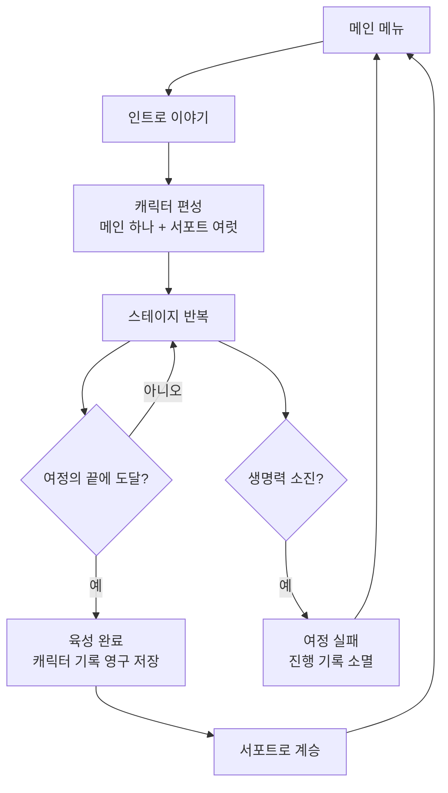
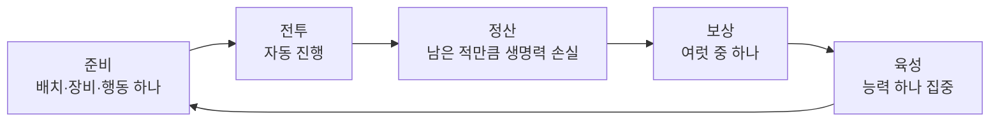

# NeverTheLast — 메인 기획서

> **1계층 문서.** 이 게임이 무엇이고, 왜 재미있으며, 무엇을 지향하는가.
> 수치는 담지 않는다. 규모는 "많다 / 적다"로만 표현한다.
> 개념 정의는 [서브 기획서](GDD_Sub_Concepts.md), 수치는 [상세 기획서](README.md#3계층--상세-기획서)를 본다.

최종 갱신: 2026-08-30

---

## 1. 한 줄 요약

> **신화 속 존재 하나를 긴 여정 동안 키워내고, 그 결과를 다음 여정에 물려주는 오토배틀 로그라이트.**

## 2. 이 게임은 무엇인가

플레이어는 신화에서 걸어 나온 캐릭터 하나를 **메인**으로 고르고, 그를 도울 **서포트** 몇을 붙여 여정을 떠난다.
여정은 여러 문명 테마를 순회하며, 각 테마는 고유한 적과 보스와 이야기를 가진다.

전투는 자동으로 진행된다. 플레이어는 칼을 휘두르지 않는다.
대신 **전투 사이에 무엇을 할지**를 고른다 — 어디에 세울지, 무엇을 입힐지, 어떤 능력을 키울지, 어떤 보상을 받을지.

여정이 끝나면 메인 캐릭터는 사라지지 않는다. **다음 여정을 돕는 서포트로 남는다.**
잘 키운 캐릭터가 쌓일수록 이후의 여정은 수월해진다.

## 3. 장르와 포지션

| 항목 | 내용 |
| --- | --- |
| 장르 | 오토배틀러 × 육성 시뮬레이션 × 로그라이트 |
| 플랫폼 | 모바일 (Android 우선) |
| 플레이 인원 | 싱글 플레이 |
| 세션 성격 | 한 여정이 **길다**. 다만 언제든 끊고 이어할 수 있다 |
| 한 스테이지 | **짧다**. 준비는 짧고, 전투는 그보다 조금 길다 |
| 언어 | 한국어 |

### 레퍼런스와 차별점

| 레퍼런스 | 가져온 것 | NTL이 다르게 하는 것 |
| --- | --- | --- |
| 우마무스메 | 육성 페이즈, 서포트 카드, 우정, 스킬 전수 | 육성 결과가 **오토배틀의 전력**으로 직결된다 |
| 붕괴: 스타레일 | 행동치 기반 순서 | 배치(전열/후열)와 결합된 하이브리드 전투 |
| 원신 | 원소 부착 개념 | 반응이 아닌 **능력 발동 조건**으로 쓴다 |
| 블루 아카이브 | 이야기 장면 연출 | 선택이 동료·장비·전투로 **분기**한다 |
| 오토체스류 | 그리드 배치, 라운드 반복 | 상점·합성이 아닌 **한 캐릭터의 성장**이 축이다 |

## 4. 디자인 필러

### 필러 1 — 육성이 곧 빌드다

매 스테이지 어떤 능력을 집중해 키울지 고른다. 그 선택이 체력·속도·기술 위력을 동시에 좌우하고,
일정 수준에 도달하면 **잠겨 있던 능력이 열린다.**
같은 캐릭터라도 어떻게 키웠느냐에 따라 전혀 다른 전투를 한다.

### 필러 2 — 전투는 관전하되, 결과는 준비에서 결정된다

전투 중 플레이어의 개입은 없다. 그래서 **전투 전의 선택 하나하나가 무겁다.**
배치, 장비, 훈련, 보상 — 이 넷이 플레이어가 쥔 손잡이 전부다.
전투는 그 선택이 옳았는지 확인하는 답안지다.

### 필러 3 — 여정은 끝나도 캐릭터는 남는다

한 여정을 끝까지 마치면 그 캐릭터의 성장 기록이 영구히 저장된다.
저장된 캐릭터는 다음 여정에서 **서포트로 되돌아와 후배를 키운다.**
실패한 여정조차 다음 도전의 정보가 된다.

### 필러 4 — 신화를 테마 단위로 소비한다

콘텐츠의 최소 묶음은 캐릭터가 아니라 **테마**다.
한 테마는 그 문명의 적, 중간 보스, 보스, 그리고 이야기 하나를 통째로 가진다.
새 테마를 붙이는 것만으로 여정의 인상이 바뀐다.

## 5. 플레이어 경험 목표

플레이어가 여정 중 느꼈으면 하는 것을 순서대로 적는다.

| 구간 | 목표 감정 | 이를 만드는 장치 |
| --- | --- | --- |
| 여정 시작 | 기대 — "이번엔 얘를 키워볼까" | 캐릭터 선택, 인트로 이야기 |
| 초반 | 안정 — 규칙을 익히는 여유 | 낮은 난이도, 단순한 보상 |
| 중반 | 계산 — "여기서 뭘 키워야 하나" | 훈련 선택지 간 실질적 트레이드오프 |
| 테마 후반 | 긴장 — 보스가 눈앞에 있다 | 중간 보스 → 보스 2단 구성, 준비 행동 제약 |
| 이야기 장면 | 환기 — 전투와 다른 결의 시간 | 비주얼 노벨 연출, 분기 선택 |
| 여정 종료 | 성취와 아쉬움 동시에 | 육성 기록 저장, 다음 여정 예고 |
| 다음 여정 | 복리 — "지난번 걔가 도와준다" | 서포트 카드 계승 |

## 6. 게임 루프

### 여정 단위 (매크로)

### 스테이지 단위 (마이크로)

여정 중간중간 전투 대신 **이야기 장면**이 끼어든다.
거기서의 선택은 동료를 늘리거나, 귀한 장비를 주거나, 위험한 전투를 부른다.

## 7. 게임 모드

| | **육성 모드** | **무한 모드** |
| --- | --- | --- |
| 목적 | 메인 하나를 여정 끝까지 키운다 | 키워둔 캐릭터들로 최고 기록에 도전한다 |
| 편성 | 메인 하나 + 서포트 여럿 | 육성을 마친 캐릭터들만 |
| 길이 | 정해진 끝이 있다 | 끝이 없다 |
| 육성 페이즈 | 있다 | 없다 |
| 보상 품질 | 진행할수록 좋아진다 | 최고 수준으로 고정된다 |
| 역할 | **콘텐츠를 생산하는 모드** | **콘텐츠를 소비하는 모드** |

두 모드는 순환한다. 육성 모드가 캐릭터를 만들고, 무한 모드가 그 캐릭터를 시험한다.

## 8. 시스템 지도

게임을 이루는 시스템과 그 존재 이유. 각 항목의 정의는 [서브 기획서](GDD_Sub_Concepts.md)에 있다.

| 시스템 | 존재 이유 | 상세 |
| --- | --- | --- |
| **진행** — 스테이지·라운드·테마 | 여정에 리듬과 예측 가능한 긴장 곡선을 준다 | [Detail_01](Detail_01_Progression.md) |
| **전투** — 행동 순서·피해·보호막·상태 | 준비 단계의 선택을 검증하는 장치 | [Detail_02](Detail_02_Combat.md) |
| **캐릭터** — 능력치·기술·잠긴 능력 | 육성 선택이 성능으로 번역되는 통로 | [Detail_03](Detail_03_Character.md) |
| **육성** — 집중 훈련·서포트·계승 | 여정 간 복리를 만드는 핵심 루프 | [Detail_04](Detail_04_Training.md) |
| **경제·보상** — 재화·장비·전리품 | 스테이지마다 작은 의사결정을 공급한다 | [Detail_05](Detail_05_Economy.md) |
| **사건** — 이야기와 분기 | 전투 반복을 끊고 세계관을 전달한다 | [Detail_06](Detail_06_Events.md) |
| **UI·저장** | 긴 여정을 끊어 갈 수 있게 한다 | [Detail_07](Detail_07_UI_Tech.md) |

## 9. 콘텐츠 볼륨 (정성 평가)

현재 시점에서 각 콘텐츠가 **충분한가**에 대한 판단이다. 실제 개수는 상세 기획서를 본다.

| 콘텐츠 | 현재 볼륨 | 판단 |
| --- | --- | --- |
| 기술(코드) | **많다** | 캐릭터별 개성을 낼 수 있는 수준 |
| 적 종류 | **충분하다** | 네 테마 분량. 전열·후열 사다리가 테마마다 다르다 |
| 테마 | **적다** | 운영 셋. 반복이 눈에 띄기 전까지의 최소선은 넘겼다 |
| 아군 캐릭터 | **많다** | 데이터상 서른 남짓 |
| ↳ 그중 실제로 편성 가능한 캐릭터 | **적다** | 🔴 절반이 잠겨 있고 **여는 방법이 없다** |
| ↳ 그중 여정을 시작할 수 있는 캐릭터 | **적다** | 여섯. 기본 편성은 되지만 조합 선택지는 좁다 |
| 이야기 장면 | **적다** | 🔴 테마마다 하나씩. **전력이 바뀌는 장면이 하나도 없다** |
| 장비 | **적다** | 🔴 중간 등급이 테마에 편중되고 상위 등급이 비어 있다 |
| 재화 종류 | 충분하다 | 🔴 다만 **쓸 곳이 전혀 없다** |

> **볼륨 문제에서 연결 문제로 넘어왔다.** 만들어 둔 것은 늘었는데,
> 캐릭터를 여는 길·재화를 쓰는 길·상위 보상으로 가는 길이 이어져 있지 않다.
> 지금 부족한 것은 대부분 **새로 만들 것이 아니라 이어 붙일 것**이다.

## 10. 현재 가장 큰 문제 세 가지

메인 기획서에 적을 만큼 구조적인 문제만 남긴다.

### 문제 1 — 만들어 둔 캐릭터의 절반을 열 수 없다

캐릭터는 서른 명 넘게 있지만 **절반이 "런 중에 합류하면 영구 해금"으로 잠겨 있고,
합류시킬 이야기 장면이 하나도 없다.** 기획도 수치도 전투 코드도 다 끝난 캐릭터들이
여는 문이 없어서 그대로 서 있다. 새 캐릭터를 만드는 것보다 **문을 다는 일이 먼저다.**

### 문제 2 — 이야기가 전력을 바꾸지 않는다

테마마다 이야기 장면이 하나씩 있지만 전부 **보스전 복선**이다.
동료를 얻거나 무언가를 고르는 장면이 없어서, 선택이 여정에 남지 않는다.
문제 1과 같은 뿌리다 — 잠긴 캐릭터를 여는 것도 이 장면이 할 일이다.

### 문제 3 — 벌이가 의미를 갖지 못한다

전투로 재화를 벌지만 **쓸 곳이 하나도 없다.**
보상으로 나오는 장비도 상위 등급이 비어 있어, 후반에는 확률표만 돌고 실제로는 초반 장비가 계속 나온다.

## 11. 개발 방향

| 순위 | 목표 | 하는 일 |
| --- | --- | --- |
| **P0** | 잠긴 것을 연다 | 동료를 얻는 이야기 장면 · 잠긴 캐릭터의 획득 경로 |
| **P1** | 루프를 닫는다 | 상위 등급 장비 채우기 · 테마마다 전용 보상 · 재화 소비처 도입 · 원소 규칙 정의 |
| **P2** | 여정을 넓힌다 | 새 테마(그림이 먼저) · 테마당 이야기 장면 늘리기 · 체크포인트 보스 재설계 |
| **P3** | 완성도를 올린다 | 자동 테스트 · 밸런스 시뮬레이터 · 튜토리얼 |

상세 항목과 선택지는 [기획 백로그](Design_Backlog.md)에 있다.

## 12. 하지 않기로 한 것

방향이 흔들릴 때 돌아올 기준선.

| 하지 않는다 | 이유 |
| --- | --- |
| 전투 중 조작 | 필러 2를 무너뜨린다. 전투는 답안지이지 시험이 아니다 |
| 유닛 합성·상점 리롤 중심 오토체스 구조 | 축이 "한 캐릭터의 성장"에서 "덱 굴리기"로 옮겨간다 |
| 멀티플레이·실시간 대전 | 육성 복리 구조와 균형을 함께 잡을 수 없다 |
| 캐릭터 클래스/서브클래스 육성 트리 | 이미 한 번 도입했다가 복잡도로 제거했다. 육성 축은 하나로 유지한다 |
| 확률형 뽑기 | 캐릭터 획득은 이야기 장면의 선택으로 얻는다 |
