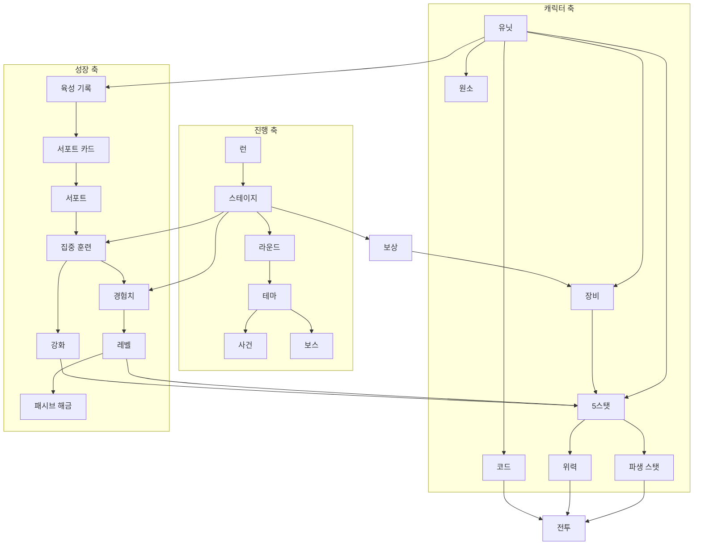

# NeverTheLast — 서브 기획서 (개념 정의)

> **2계층 문서.** 게임에 등장하는 모든 개념의 **정의**와 **개념 간 관계**를 확정한다.
> "무엇인가"와 "왜 있는가"까지만 다룬다. **"얼마인가"는 상세 기획서**에서 다룬다.
> 비전과 방향은 [메인 기획서](GDD_Main.md)를 본다.

최종 갱신: 2026-08-10

---

## 개념 전체 지도

---

## 1. 진행 개념

### 1.1 런(Run)

**정의** — 캐릭터 편성부터 여정의 종료(클리어 또는 실패)까지의 1회 플레이.

**왜 있는가** — 로그라이트의 시행 단위. 런이 끝나야 계승이 일어나고, 계승이 있어야 반복 플레이에 의미가 생긴다.

**관계** — 런은 여러 스테이지를 담고, 런 종료 시 육성 기록을 생산한다. 런 범위 상태(우정도, 발생한 사건 이력, 소지 재화)는 런이 끝나면 초기화된다.

### 1.2 스테이지(Stage)

**정의** — 전투 1회 또는 사건 1회에 해당하는 진행의 최소 단위.

**왜 있는가** — 준비 → 전투 → 보상 → 육성으로 이어지는 마이크로 루프를 담는 그릇.

**관계** — 스테이지 번호가 오르면 적이 강해지고, 보상 등급이 좋아지며, 사건·보스 슬롯이 결정된다.

### 1.3 라운드(Round)

**정의** — 일정 개수의 스테이지를 묶은 단위. 테마 하나에 정확히 대응한다.

**왜 있는가** — 여정에 리듬을 준다. 라운드 안에서 "일반 전투가 이어지다 → 이야기가 끼어들고 → 중간 보스 → 보스"라는 긴장 곡선이 반복된다.

**관계** — 라운드 번호는 보상 등급 확률을 결정한다. 라운드가 바뀌면 테마도 바뀐다.

### 1.4 테마(Theme)

**정의** — 하나의 신화/문명을 단위로 묶은 **콘텐츠 패키지**. 등장 적, 중간 보스, 보스, 사건, 고유 보상을 통째로 포함한다.

**왜 있는가** — 콘텐츠 확장의 최소 단위를 캐릭터가 아니라 테마로 잡으면, 한 덩어리를 추가할 때마다 여정의 인상이 통째로 바뀐다.

**관계** — 테마는 라운드에 배정되고, 적 데이터를 필터링하는 기준이 되며, 자신만의 사건과 보상을 풀에 밀어 넣는다.

### 1.5 스테이지 슬롯

**정의** — 라운드 안에서 각 스테이지가 맡는 **역할**. 일반 전투 / 사건 / 중간 보스 / 보스로 나뉜다.

**왜 있는가** — 플레이어가 라운드 내 위치만 보고 다음에 무엇이 올지 예측할 수 있어야, 준비 단계의 선택이 전략이 된다.

**관계** — 슬롯이 사건이면 전투가 발생하지 않는다. 슬롯이 보스면 준비 페이즈의 행동이 제한된다.

### 1.6 고정 보스

**정의** — 테마와 무관하게 특정 스테이지에 반드시 등장하는 보스.

**왜 있는가** — 긴 여정의 **체크포인트**. 테마 순환과 별개로 "여기까지 왔다"는 이정표를 준다.

**관계** — 고정 보스가 있는 라운드에서는 그 라운드의 테마 보스가 한 칸 앞으로 밀린다.

### 1.7 생명력

**정의** — 런의 남은 내구도. 전투에서 적을 다 잡지 못하면 남은 적 수만큼 잃는다.

**왜 있는가** — 개별 전투의 패배를 즉시 게임 오버로 만들지 않으면서, **누적된 실패**에는 대가를 물린다.

**관계** — 0이 되면 런이 실패하고 진행 저장이 삭제된다.

### 1.8 게임 모드

**정의** — 런의 규칙 집합. 육성 모드와 무한 모드 두 가지.

**왜 있는가** — 육성 모드는 캐릭터를 **생산**하고, 무한 모드는 그 캐릭터를 **소비**한다. 둘이 순환해야 계승 구조가 완성된다.

**관계** — 모드에 따라 편성 가능 캐릭터, 스테이지 상한, 육성 페이즈 유무, 보상 확률 산정 방식이 달라진다.

---

## 2. 전투 개념

### 2.1 전장과 셀

**정의** — 양 진영이 마주 보는 격자. 각 진영은 **전열**과 **후열**을 가진다.

**왜 있는가** — 배치를 의사결정으로 만든다. 전열은 맞고, 후열은 때린다.

**관계** — 유닛은 셀 하나를 점유한다. 셀은 유닛의 상태 표시(체력·자원 바)도 담당한다.

### 2.2 대기석

**정의** — 전투에 참여하지 않는 유닛을 두는 자리.

**왜 있는가** — 편성한 캐릭터를 잃지 않으면서 출전 인원만 조절할 수 있게 한다.

**관계** — 대기석 유닛은 전투 판정과 UI 표시 모두에서 제외된다.

### 2.3 행동치(Action Value, AV)

**정의** — 유닛이 다음 행동까지 남은 값. **작을수록 먼저 행동한다.** 속도가 높을수록 작게 산출된다.

**왜 있는가** — 속도 능력치에 명확한 의미를 준다. 동시에, 누가 언제 움직이는지를 UI에 보여줄 수 있게 만든다.

**관계** — 속도는 민첩 계열 능력치에서 파생된다. 행동치가 소진되면 행동이 예약된다.

### 2.4 행동 직렬화

**정의** — 전투 중 **한 번에 한 유닛만** 행동한다는 규칙. 누군가 행동 중이면 다른 유닛의 행동치는 멈춘다.

**왜 있는가** — 동시다발적 난타를 없애면 각 행동의 인과가 눈에 보인다. 연출과 로그 모두 읽을 수 있게 된다.

**관계** — 일반 공격도 예외가 아니다. 다만 궁극기는 대기열을 새치기할 수 있다.

### 2.5 피해와 방어

**정의** — 피해는 공격 측 수치에서 방어 측 수치를 **깎고**, 다시 방어 비례로 **비율 감산**한 값이다.

**왜 있는가** — 감산만 쓰면 저타수 고위력이 무적이 되고, 비율만 쓰면 방어가 무한히 강해진다. 두 방식을 겹쳐 양쪽 극단을 막는다.

**관계** — 상태 효과와 장비가 이 계산의 여러 지점에 개입한다.

### 2.6 보호막

**정의** — 체력보다 먼저 소모되는 임시 내구도.

**왜 있는가** — 회복과 다른 방어 축을 만든다. 회복은 사후 대응이고 보호막은 사전 대비다.

**관계** — 관통 태그를 가진 피해와 지속 피해는 보호막을 무시한다. 라운드가 끝나면 사라진다.

### 2.7 피해 태그

**정의** — 피해에 붙는 성질 표식. 방어 관통, 보호막 관통 등.

**왜 있는가** — 특정 방어 축을 무력화하는 설계를 데이터로 표현하기 위한 수단.

**관계** — 피해 계산 파이프라인의 분기 조건으로 쓰인다.

### 2.8 상태(Status)와 효과(Effect)

**정의** — **상태**는 유닛에 붙는 지속 표식이고, **효과**는 그 상태가 실제로 하는 일이다. 상태 하나가 효과 여럿을 가질 수 있다.

**왜 있는가** — "무엇이 붙어 있는가"(플레이어에게 보여줄 것)와 "무엇을 하는가"(계산에 쓸 것)를 분리하면, 같은 효과를 여러 상태가 재사용할 수 있다.

**관계** — 상태는 카테고리(이로움/해로움/중립)와 **중첩 정책**을 가진다. 효과는 생명주기 훅과 스탯 질의 훅으로 계산에 개입한다.

### 2.9 중첩 정책

**정의** — 같은 상태가 다시 부여될 때의 처리 규칙. 독립 중첩 / 지속시간 연장 / 강한 것으로 교체 / 무시 / 무조건 교체.

**왜 있는가** — 맹독은 쌓이고 화상은 길어지는 식의 **상태별 개성**을 데이터로 표현한다.

**관계** — 시전자별로 따로 쌓이게 하려면 식별 키에 시전자를 포함시킨다.

### 2.10 원소와 부착

**정의** — 유닛은 **고유 원소**를 항상 가지며, 전투 중 원소를 일시적으로 **부착**받을 수 있다.
고유 원소는 그 유닛이 무엇인지를 말하는 속성이고, 원소 반응의 재료가 되는 것은 부착된 원소뿐이다.

**왜 있는가** — 코드(기술)의 발동 조건을 "적이 무슨 상태인가"로 확장한다. 캐릭터 간 상호작용을 만드는 축.

**관계** — 부착은 시간이 지나면 사라지고, 라운드가 끝나면 초기화된다.

### 2.12 원소 반응

**정의** — 두 원소가 한 유닛에게 겹치면 일어나는 사건. 두 원소가 함께 사라지고 지속피해가 남는다.

**왜 있는가** — 원소를 "조건 표식"에서 **팀 조합의 축**으로 끌어올린다.
서로 다른 원소를 가진 아군을 함께 편성할 이유가 생긴다.

**관계** — 피해가 **반응을 일으킨 유닛의 CON**에 비례하므로 딜러가 아닌 유닛도 기여할 수 있다.
반응이 남기는 것은 지속피해이므로, 지속피해를 증폭하거나 정산하는 캐릭터와 곧바로 맞물린다.
🔸 현재 정의된 반응은 감전(물+번개)과 화상(불+풀) 둘뿐이다.

### 2.11 유닛 이벤트

**정의** — 유닛의 생애와 전투 흐름에서 발생하는 신호. 스폰, 사망, 피해 전/중/후, 기술 발동, 라운드 시작/종료 등.

**왜 있는가** — 코드와 효과가 **직접 서로를 참조하지 않고** 동작하게 만든다. 새 능력을 추가할 때 기존 코드를 고칠 필요가 없어진다.

**관계** — 하나의 이벤트에 리스너를 여럿 붙일 수 있다. 영구 리스너를 붙였다면 **해제 조건을 반드시 함께 설계한다.**

---

## 3. 캐릭터 개념

### 3.1 유닛(Unit)

**정의** — 전장에 서는 모든 존재. 아군과 적 모두 같은 클래스를 쓴다.

**왜 있는가** — 아군과 적이 같은 규칙 위에 있어야 적에게도 능력·원소·상태를 그대로 쓸 수 있다.

**관계** — 유닛은 5스탯, 코드, 원소, 장비, 상태를 가진다.

### 3.2 5스탯

**정의** — 플레이어가 직접 키우는 다섯 개의 기본 능력치.

| 스탯 | 담당 영역 |
| --- | --- |
| **STR** | 힘. 장비 운반 능력 |
| **DEX** | 민첩. 행동 속도 |
| **CON** | 체력. 최대 체력, **방어**, 회복량, 보호막량 |
| **INT** | 지능. 자원 효율, 배울 수 있는 기술 수 |
| **LUK** | 운. 치명타 |

여기에 더해, 캐릭터의 **주스탯이 무엇이냐에 따라 그 스탯이 공격의 근거**가 된다(→ 3.5 위력).

**왜 있는가** — 육성 페이즈의 선택지를 다섯 개로 고정한다. 선택지가 다섯이면 매 스테이지의 판단이 무겁되 부담스럽지 않다.

**관계** — 5스탯은 기본값 + 성장 + 강화 + 장비 + 상태로 합산되고, 여기에 캐릭터별 **트레이닝 보너스**가 적용된다. 일반은 주 +20%/부 +10%, 부스탯이 둘이면 각 +5%이며 세이·시는 +25%/+15%다.

### 3.3 주스탯 / 부스탯

**정의** — 캐릭터마다 지정된, 성장 효율이 더 좋은 능력치.

**왜 있는가** — 캐릭터별 육성 방향을 암시한다. "이 캐릭터는 이걸 키우는 게 이득"이라는 신호.

**관계** — 보너스는 5스탯 합산 마지막 단계에 적용되며, `subStats`는 최대 2개까지 허용한다.

### 3.4 파생 스탯

**정의** — 5스탯에서 계산되는 실제 전투 수치. 위력, 최대 체력, 방어력, 치명타, 행동 속도 등.

**왜 있는가** — 플레이어가 만지는 손잡이(5개)와 전투가 쓰는 값(여러 개)을 분리한다.

**관계** — **예외 없이 전부 5스탯에서 나온다.** 별도의 공격력·방어력 스탯은 존재하지 않는다.

### 3.5 위력

**정의** — 기술의 피해를 계산하는 기준값. **주스탯에서 파생된다.**

**왜 있는가** — 공격 능력치를 따로 두면 5스탯과 이중 관리가 되고, 육성 선택이 화력으로 이어지지 않는다.
위력을 주스탯 파생으로 두면 **무엇을 키우든 그것이 곧 화력이 된다.**

**관계** — 모든 기술은 `위력 × 계수` 형태로 피해를 낸다. 힘으로 싸우는 전사와 지능으로 싸우는 술사가
같은 규칙 위에서 공존한다. 주스탯은 5스탯 어느 것이든 가능하며, 공격과 고유 역할을 동시에 얻는 이중 이득은 의도된 설계다.

### 3.6 레벨

**정의** — 유닛의 성장 단계. 스탯은 언제나 `기본값 + 성장분 × (레벨 − 1)`이다.

**왜 있는가** — 아군과 적이 **같은 공식** 위에 있어야 강함을 비교하고 균형을 잡을 수 있다.

**관계** — 공식은 같지만 **레벨을 얻는 방법이 다르다.** 적은 스테이지가 정해 주고,
아군은 경험치를 모아 직접 올려야 한다. 이 비대칭이 "진행만으로는 강해지지 않는다"는 긴장을 만든다.

### 3.7 경험치

**정의** — 아군이 레벨을 올리기 위해 모으는 값. 적 처치·스테이지 클리어·육성에서 얻는다.

**왜 있는가** — 아군의 성장을 **플레이 결과에 연동**한다. 적을 많이 잡고 육성을 거를수록 뒤처진다.

**관계** — 획득량은 스테이지에 비례하지만 필요량이 레벨에 비례해 늘어나므로,
후반으로 갈수록 레벨만으로는 적을 따라가지 못한다. 그 격차를 메우는 것이 육성 강화와 장비다.

### 3.8 강화

**정의** — 육성·보상으로 쌓는 스탯 증가분. 레벨과 별개의 축이다.

**왜 있는가** — 레벨이 "얼마나 진행했는가"라면 강화는 "무엇을 선택했는가"다.
둘을 분리해야 플레이어가 키운 몫이 눈에 보인다.

### 3.9 코드(Code)

**정의** — 유닛의 기술. 세 분류로 나뉜다.

| 분류 | 발동 시점 |
| --- | --- |
| **패시브** | 라운드 시작 시 활성화되어 조건부로 작동 |
| **일반** | 자기 행동 차례에 사용 |
| **궁극기** | 전용 자원이 가득 찼을 때 사용 |

**왜 있는가** — 상시 효과 / 반복 행동 / 결정타를 각각 분리해야 캐릭터의 리듬이 생긴다.

**관계** — 코드는 데이터 등록, C# 구현, 팩토리 연결 세 곳이 모두 맞아야 동작한다.

### 3.10 궁극기 자원

**정의** — 궁극기의 발동 조건이 되는 자원. **마나형**(시간에 따라 회복)과 **스택형**(특정 행동으로 축적) 두 종류.

**왜 있는가** — 마나형만 있으면 모든 캐릭터의 궁극기 리듬이 똑같아진다. 스택형은 "무엇을 해야 궁극기가 차는가"를 캐릭터별로 다르게 만든다.

**관계** — 자원이 가득 차도 **즉시 발동하지 않는다.** 행동 가능한 타이밍에 예약되어, 행동 직렬화 규칙을 지킨다.

### 3.11 패시브 해금

**정의** — 캐릭터가 일정 수준에 도달하면 잠겨 있던 패시브가 열리는 구조.

**왜 있는가** — 육성의 보상을 **수치가 아닌 능력**으로 준다. 필러 1("육성이 곧 빌드다")을 실제로 성립시키는 장치.

**관계** — 해금 판정은 성장 레벨과 트레이닝 레벨의 **합**으로 이루어진다. 즉 육성이 해금을 앞당긴다.

### 3.12 장비와 슬롯

**정의** — 유닛이 착용하는 아이템. 부위별 슬롯이 정해져 있다.

**왜 있는가** — 보상으로 얻은 물건을 즉시 전력으로 바꾸는 통로.

**관계** — 장비는 5스탯을 올리고, **코드를 부여할 수도 있다.** 후자가 장비를 단순 수치 이상으로 만든다.

### 3.13 중량과 숙련도

**정의** — **중량**은 장착 장비와 개인 인벤토리를 합친 휴대 부담이고, **숙련도**는 장비 효과를 활성화하는 자격이다. 미숙련 장비도 들거나 장착할 수 있지만 중량 외 효과가 없다.

**왜 있는가** — 좋은 장비를 무제한으로 겹쳐 입지 못하게 하는 제약. 중량 상한이 힘 능력치와 연동되어 육성 선택에 영향을 준다.

**관계** — 캐릭터별 시작 숙련과 장비 요구 숙련을 실제로 검사한다. 추가 숙련은 해금/전수 패시브로 열리고, 이미 가진 숙련은 중복 효과가 없다.

---

## 4. 성장·계승 개념

### 4.1 육성 페이즈

**정의** — 스테이지 사이에 메인 캐릭터의 능력치 하나를 골라 집중적으로 키우는 단계.

**왜 있는가** — 게임의 중심 의사결정. 전투가 자동인 만큼, 이 선택이 플레이어의 실질적 조작이다.

**관계** — 훈련은 능력치를 올리는 동시에 트레이닝 레벨을 올려 패시브 해금을 앞당긴다.

### 4.2 트레이닝 레벨

**정의** — 육성 페이즈를 거칠 때마다 오르는, 메인 캐릭터 전용 레벨.

**왜 있는가** — "얼마나 성실히 키웠는가"를 하나의 숫자로 축약한다. 패시브 해금과 계승 품질의 기준이 된다.

**관계** — 성장 레벨과 합산되어 패시브 해금을 판정한다. 육성 모드에서 **메인만** 오른다.

### 4.3 서포트

**정의** — 메인과 함께 편성되어 훈련을 돕는 캐릭터.

**왜 있는가** — 편성을 의미 있게 만든다. 누구를 데려가느냐가 육성 효율을 좌우한다.

**관계** — 서포트는 전투에도 참여하면서 동시에 훈련도 보조한다. 두 역할을 겸하는 것이 편성 고민의 핵심.

### 4.4 서포트 카드

**정의** — 육성을 마친 캐릭터가 남기는 **훈련 보조 데이터**. 특기 능력치, 등장 확률, 보너스 크기, 기술 전수 확률 등을 담는다.

**왜 있는가** — 계승 구조의 실체. 지난 런의 성과가 다음 런의 성능으로 번역되는 지점.

**관계** — 원본 캐릭터의 최종 능력치와 트레이닝 레벨이 좋을수록 카드 성능이 좋아진다.

### 4.5 특기 훈련과 등장

**정의** — 서포트 카드는 **특기 능력치**를 하나 가진다. 플레이어가 그 능력치를 집중 훈련으로 고르면 서포트가 높은 확률로 **등장**해 큰 보너스를 준다.

**왜 있는가** — 편성과 훈련 선택을 연결한다. "이 서포트를 데려왔으니 이 능력치를 키우자"는 계획을 만든다.

**관계** — 특기가 아닌 능력치를 고르면 등장 확률이 크게 떨어진다.

### 4.6 우정도(Bond)

**정의** — 서포트별로 런 동안 누적되는 친밀도. 함께 훈련할수록 오른다.

**왜 있는가** — 런 내에 **장기 투자**의 축을 만든다. 초반에 손해를 감수하고 한 서포트에 집중하면 후반에 회수된다.

**관계** — 일정 수준을 넘기면 **우정 훈련**이 발동해 보너스가 추가된다. 런이 끝나면 초기화된다.

### 4.7 패시브 전수

**정의** — 서포트가 가진 패시브를 메인이 배우는 것.

**왜 있는가** — 계승을 수치가 아닌 **능력**의 상속으로 확장한다. 같은 캐릭터라도 어떤 서포트와 키웠느냐에 따라 결과물이 달라진다.

**관계** — 특기가 일치하고 서포트가 등장한 훈련에서만, 확률적으로 발생한다. 전수 가능 표식이 붙은 패시브만 대상이 된다.

### 4.8 육성 기록과 칭호

**정의** — 런을 완주한 메인 캐릭터의 최종 상태 스냅샷. 능력치, 트레이닝 레벨, 습득 패시브, 서포트 카드, 칭호를 포함한다.

**왜 있는가** — 런의 결과물을 영구히 남긴다. 이것이 없으면 실패한 런과 완주한 런의 차이가 없다.

**관계** — 육성 기록이 있어야 무한 모드에서 그 캐릭터를 쓸 수 있고, 다른 런에서 서포트로 부를 수 있다.

---

## 5. 경제·보상 개념

### 5.1 재화

**정의** — 런 동안 축적되는 소비 가능 자원. 골드, 원소 토큰, 리롤 티켓.

**왜 있는가** — 전투의 결과를 즉시 소비할 수 있는 형태로 바꿔 준다.

**관계** — 🔸 **현재 토큰과 리롤 티켓은 획득만 되고 소비처가 없다.** 골드도 소비처가 이야기 장면 하나뿐이다. 재화 루프가 닫혀 있지 않다.

### 5.2 보상

**정의** — 전투 종료 후 제시되는 선택지들. 그중 하나를 고른다.

**왜 있는가** — 스테이지마다 작은 의사결정을 공급한다. 육성 페이즈가 장기 계획이라면 보상은 즉시 판단이다.

**관계** — 보상 풀은 아이템 데이터에서 자동 생성되고, 테마 고유 보상이 추가로 섞인다.

### 5.3 보상 등급(티어)

**정의** — 보상의 품질 단계.

**왜 있는가** — 여정이 진행될수록 좋은 물건이 나오게 해서 성장 실감을 만든다.

**관계** — 라운드가 오를수록 낮은 등급이 풀에서 빠지고 높은 등급이 들어온다.
🔸 다만 중간 등급 아이템이 비어 있어 현재 이 확률표는 온전히 작동하지 않는다.

### 5.4 사건 전용 아이템

**정의** — 일반 보상 풀에 등장하지 않고, 이야기 장면의 선택으로만 얻는 아이템.

**왜 있는가** — 이야기 선택에 실질적 무게를 준다. "그때 그 선택을 했어야 했다"를 만든다.

---

## 6. 사건 개념

### 6.1 사건(Event)

**정의** — 전투 대신 진행되는 이야기 장면. 대사와 선택지로 구성된다.

**왜 있는가** — 전투 반복을 끊는 환기점이자 세계관 전달 통로이며, 동시에 **동료와 귀한 장비를 얻는 유일한 경로**다.

**관계** — 테마마다 배정되며, 라운드 내 지정 슬롯에서 발생한다.

### 6.2 사건 선택지와 액션

**정의** — 사건의 분기. 각 선택지는 하나의 **액션**을 수행한다 — 진행, 영입, 전투 후 영입, 전투 후 아이템, 재화 지불, 패시브 부여.

**왜 있는가** — 이야기가 서사로만 끝나지 않고 전력 변화로 이어지게 한다.

**관계** — 선택지에는 비용과 위험이 표기된다. 플레이어는 현재 전력과 재화를 근거로 판단한다.

### 6.3 런당 1회 / 차단 조건

**정의** — 사건은 런당 한 번만 발생하도록 지정할 수 있고, 특정 캐릭터를 이미 보유했다면 발생하지 않게 할 수 있다.

**왜 있는가** — 이미 영입한 동료를 다시 영입하라는 선택지가 뜨는 것을 막는다.

### 6.4 비주얼 노벨 연출

**정의** — 사건을 표시하는 화면 형식. 초상화, 스탠딩, 표정, 화면 효과, 음향, 타자기 속도를 대사 단위로 지정한다.

**왜 있는가** — 같은 데이터 구조로 인트로 시퀀스까지 재생할 수 있어, 연출 자산을 한 곳에 모은다.

**관계** — 지정한 에셋이 없으면 **조용히 무시**된다. 데이터를 먼저 쓰고 에셋은 나중에 채울 수 있다.

### 6.5 사건 스케줄러

**정의** — 페이즈 사이 임의 지점에 사건을 끼워 넣는 예약 큐.

**왜 있는가** — 사건을 고정 슬롯에만 묶지 않는다. 전투 직전, 보상 직후 등 어디서든 이야기를 발생시킬 여지를 남긴다.

---

## 7. 데이터·저장 개념

### 7.1 데이터 주도 설계

**정의** — 유닛, 적, 코드, 아이템, 테마, 사건, 보상 확률을 모두 YAML 데이터로 정의하고 코드는 그것을 해석만 한다.

**왜 있는가** — 콘텐츠 추가에 재컴파일이 필요 없게 만든다. 기획자가 직접 데이터를 만질 수 있다.

**관계** — 예외는 **코드(기술)의 실제 동작**이다. 이것만은 C# 구현과 팩토리 연결이 필요하다.

### 7.2 진행 저장 vs 영구 저장

**정의** — **진행 저장**은 현재 런의 스냅샷이고, **영구 저장**은 런과 무관하게 남는 육성 기록이다.

**왜 있는가** — 긴 여정을 끊어 갈 수 있게 하면서(진행 저장), 실패해도 성과는 남기게 한다(영구 저장).

**관계** — 런이 실패하거나 완주하면 진행 저장은 삭제되지만 영구 저장은 남는다.

### 7.3 매니저와 단일 진입점

**정의** — 각 시스템은 전담 매니저가 소유하고, 상태 전이는 정해진 진입점 하나를 통해서만 일어난다.

**왜 있는가** — "다음 스테이지로 간다"가 보상·사건·육성 어느 흐름에서 호출되든 같은 종료 판정을 거치게 한다. 흐름이 갈라져도 규칙은 하나로 유지된다.
